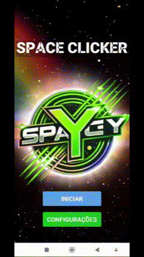

# 👽 Space Clicker 

Space Clicker é um jogo de cliques dinâmico, onde o jogador controla uma espaçonave clicando o mais rápido possível para acumular pontos antes que o tempo acabe. Com gráficos animados, música de fundo emocionante e interatividade, o Space Clicker é perfeito para testar sua habilidade e reflexos!

---

## 🚀 Funcionalidades

- **Controle da espaçonave**: Clique na espaçonave para acumular pontos.
- **Dificuldades ajustáveis**: Escolha entre Fácil, Normal e Difícil, alterando o tamanho da espaçonave.
- **Sistema de pontuação**: Registro das pontuações mais altas em um placar interativo.
- **Personalização de nick**: Escolha um apelido único para exibir no placar.
- **Músicas animadoras**: Cada tela possui sua própria trilha sonora dinâmica.
- **Créditos**: Uma homenagem especial aos desenvolvedores do jogo em estilo de rolagem Star Wars.
- **API Integrada**: Sistema que salva as pontuações e os nicks em um servidor remoto para garantir persistência e consulta de dados no ranking.

---

## 🎥 Visualização das Telas

### Tela Inicial e Tela de Configurações

| **Tela Inicial**                              | **Tela de Configurações**                     |
|-----------------------------------------------|-----------------------------------------------|
| <div align="center"></div> | <div align="center"></div> |
| <p align="center">O ponto de partida do jogo, onde o jogador pode escolher entre iniciar ou acessar as configurações.</p> | <p align="center">Personalize sua experiência ajustando a dificuldade e configurando o apelido do jogador.</p> |

---

### Gameplay e Placar de Pontuação

| **Gameplay**                                  | **Placar de Pontuação**                       |
|-----------------------------------------------|-----------------------------------------------|
| <div align="center"></div> | <div align="center"></div> |
| <p align="center">Clique na espaçonave o mais rápido possível para acumular pontos antes que o tempo acabe.</p> | <p align="center">Veja o ranking dos melhores jogadores com suas pontuações atualizadas em tempo real.</p> |

---

### Créditos

| **Créditos**                                  |                                               |
|-----------------------------------------------|-----------------------------------------------|
| <div align="center"></div> | <div align="center"></div> |
| <p align="center">Agradecimento aos desenvolvedores do Space Clicker, apresentado em um estilo de rolagem inspirado em Star Wars.</p> |  |

---

## 🌐 Integração com API

O **Space Clicker** utiliza uma API RESTful para armazenar e consultar os dados de pontuação e nick dos jogadores. Com isso, garantimos que:

- As pontuações sejam persistidas mesmo após fechar o aplicativo.
- O ranking seja atualizado em tempo real para todos os jogadores.

**Endpoints utilizados:**
- **`POST /score`**: Para salvar a pontuação e o nick do jogador.
- **`GET /leaderboard`**: Para buscar as pontuações ordenadas e exibi-las no ranking.

---

## 🛠️ Ferramentas Utilizadas

- **Visual Studio Code**: Ambiente de desenvolvimento.
- **Expo**: Plataforma para desenvolvimento mobile.
- **GIMP**: Criação e edição das imagens e ícones do jogo.
- **Clipchamp**: Edição de vídeos e criação de GIFs para apresentação.

---

## 📋 Requisitos

- **Node.js** (versão 14 ou superior)
- **Expo CLI**
- Emulador Android/iOS ou dispositivo físico

---

## 💻 Como Executar

1. Clone este repositório:
   ```bash
   git clone https://github.com/seu-repositorio/space-clicker.git
   cd space-clicker
   ```
2. Instale as dependências:
   ```bash
   npm install
   
3. Inicie o aplicativo:
   ```bash
   npm start
   ```

   ## 👨‍💻 Desenvolvedores 
- **Arthur Carreiro** - [arcarreiro](https://github.com/arcarreiro)
- **Gabriel Toledo** - [gabrieltol7do](https://github.com/gabrieltol7do)
- **Lucas Schumacker** - [schumacker1o](https://github.com/schumacker1o)
- **Luiz Vinicius** - [ViniciusCassiano2105](https://github.com/ViniciusCassiano2105)
- **Matheus Lopes** - [math3us-lopes](https://github.com/math3us-lopes)
- **Sávio Castro** - [7csavio](https://github.com/7csavio)
- **Weliton Schitini** - [weliton-schitini](https://github.com/weliton-schitini)


